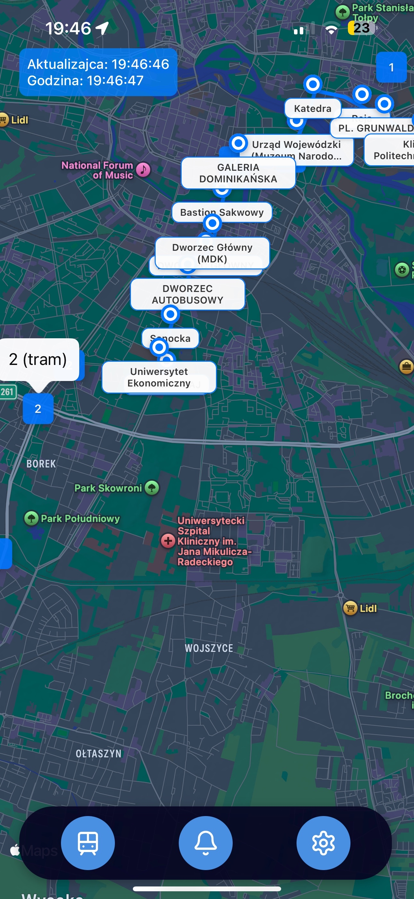
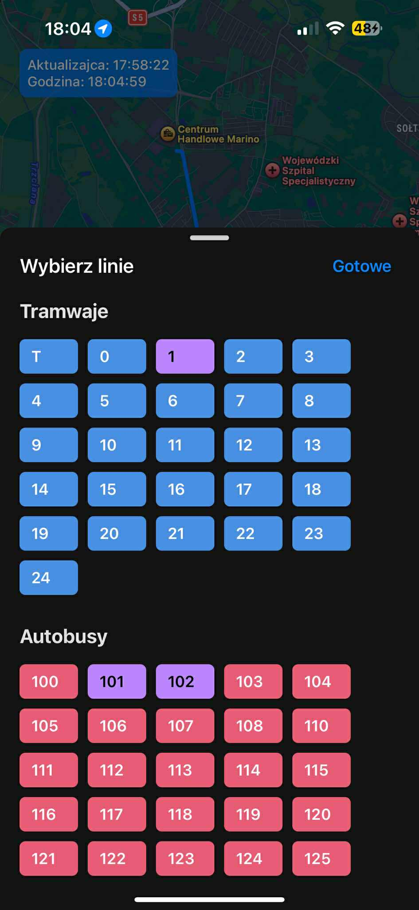

# Wrocław MPK Map

Real-time tracking application for public transportation in Wrocław, Poland. Track buses and trams on an interactive map with live updates and service alerts.

## Screenshots

<div style="display: flex; gap: 10px;">
    
    
</div>

## Features

- 🚌 Real-time vehicle tracking
- 🚊 Support for all types of public transport:
  - Regular trams and buses
  - Night buses
  - Express buses
  - Suburban buses
  - Temporary lines
  - Special lines
- 🗺️ Route shapes visualization
- ⚠️ Service alerts and disruptions (soon)
- 🔄 Auto-updating every 10 seconds
- 📱 Mobile-friendly interface

## Project Structure

```
├── app/                   # React Native mobile application
│   ├── components/       # Reusable UI components
│   ├── modals/          # Modal dialog components
│   └── assets/          # Images and static assets
└── server/              # Express.js backend server
    ├── utils/           # Utility functions
    └── data/           # GTFS data storage
```

## Backend API Endpoints

- `GET /lines` - Get all categorized transport lines
- `GET /lines/:category` - Get lines for a specific category
- `GET /locations` - Get real-time vehicle locations
- `GET /shapes/:line` - Get route shape for specific line
- `GET /alerts` - Get service alerts and disruptions
- `GET /health` - Server health check endpoint

## Technologies Used

### Backend
- Node.js
- Express.js
- GTFS data integration
- Real-time data from MPK Wrocław API

### Frontend
- React Native
- React Native Maps
- Custom components for vehicle tracking

## Installation

### Backend Server

1. Navigate to the server directory:
```bash
cd server
```

2. Install dependencies:
```bash
npm install
```

3. Start the server:
```bash
npm start
```

The server will run on port 3000 by default.

### Mobile App

1. Navigate to the app directory:
```bash
cd app
```

2. Install dependencies:
```bash
npm install
```

3. Start the development server:
```bash
npm start
```

4. Use the Expo Go app to run the application on your device, or run in an emulator.

## Data Sources

- GTFS Data: [Wrocław Open Data](https://www.wroclaw.pl/open-data/)
- Real-time vehicle positions: MPK Wrocław API

## Features in Detail

### Vehicle Categories
- Regular trams (lines 0-39)
- Temporary trams (lines 70-99)
- Regular buses
- Night buses (lines 200-299)
- Express buses (A, C, D, K, N)
- Suburban buses (lines 600-699)
- Temporary buses (lines 700-799)
- Zone buses (lines 900-999)
- Special buses (B-prefix)

### Real-time Updates
- Vehicle positions update every 10 seconds
- GTFS data refreshes daily
- Service alerts are provided in real-time

## Contributing

Feel free to contribute to this project by submitting issues or pull requests. Please ensure that your code follows the existing style and includes appropriate tests.

## License

This project uses public transport data from MPK Wrocław and the City of Wrocław Open Data platform. Please ensure compliance with their terms of use when using this application.


