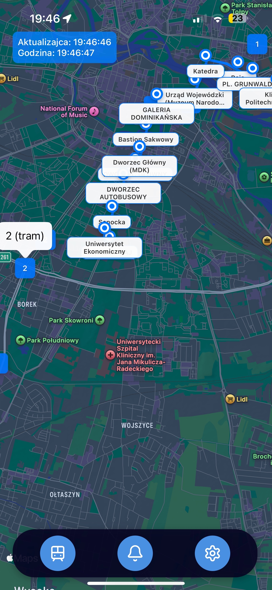
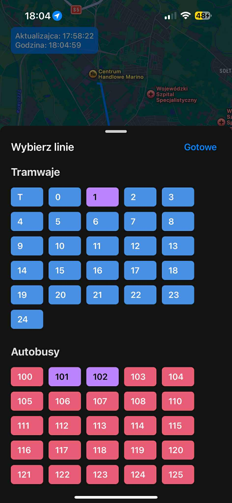
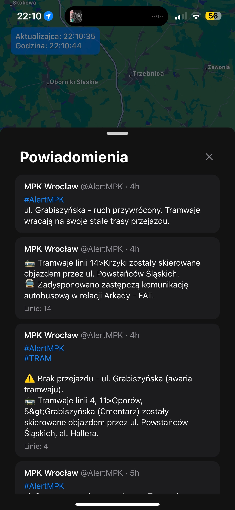

# Wrocław MPK Map

Real-time tracking for Wrocław's trams and buses: an Expo app and the API that feeds it.
Vehicle positions come from MPK Wrocław's public endpoint, timetables and route shapes from
the city's GTFS feed, and disruption notices scraped from public city and MPK pages.

<div style="display: flex; gap: 10px;">
    
    
    
</div>

> Not affiliated with MPK Wrocław. It reads public data the city publishes as open data.

## Quick start

```bash
# API
cd server
npm install
npm run doctor   # confirms MPK and the city portal are answering right now
npm start        # http://localhost:3000

# App (in another terminal)
cd app
npm install
API_URL=http://localhost:3000 npm start
```

Open <http://localhost:3000/map> for a browser map and <http://localhost:3000/status> for a
dashboard showing which upstream sources are live.

## Why things break, and how this handles it

Both upstream sources have moved before — the city migrated its open-data portal, and the
`bus_position` endpoint has changed shape more than once. So no URL is hardcoded in one
place:

- **The GTFS archive is discovered at runtime, never hardcoded.** The server asks the
  city's data API (`api.open-data.cui.wroclaw.pl/od2/6/`), falls back to the legacy CKAN
  instance and then a national mirror. A hardcoded resource UUID on the portal the city
  retired in April 2026 is exactly what broke this project.
- **It picks the timetable actually in force.** That archive contains future-dated
  snapshots — on 2026-07-30 it already listed one effective 1 August. Taking the newest
  would show wrong departure times with no error, so selection is *latest effective date
  ≤ today*.
- **Incomplete snapshots are rejected.** Some are missing `shapes.txt`, which would leave
  the map with no routes; each candidate is validated and the next one tried.
- **`npm run doctor`** checks all of them from your machine and prints exactly what failed.
- **The GTFS archive is cached on disk.** If the portal is down at boot, the server starts
  with the last good timetable rather than serving nothing.
- **Both documented request formats are tried.** `bus_position` is described in the wild
  with two different bodies — `busList[bus][]`/`busList[tram][]` and `busList[][]` — and it
  answers `200 []` rather than an error when it does not like the one you sent. The tracker
  tries each, sticks to whichever works, and shows it on `/health` as `vehicles.encoding`.
- **Vehicle records are matched by field aliases,** so a renamed `x`/`y` field does not
  silently produce an empty map.
- **A scheduled GitHub Action** runs the doctor daily and opens an issue when a required
  source stops answering.

## API

Base URL: your deployment, or `http://localhost:3000`.

| Endpoint | Description |
| --- | --- |
| `GET /lines` | All lines grouped by category (`tram`, `busNight`, `busExpress`, …) |
| `GET /lines/:category` | One category |
| `GET /locations` | Live vehicle positions. `?line=4,17` and `?type=tram` filter |
| `GET /shapes/:line` | Route shape and stops. `?lat=&lon=` picks the variant nearest a vehicle, `?format=compact` halves the payload |
| `GET /shapes/:line/variants` | Every variant of a route |
| `GET /stops?q=rynek` | Stop search, diacritic-insensitive |
| `GET /stops/near?lat=&lon=` | Stops near a point, nearest first. `?radius=` (m) `?limit=` |
| `GET /stops/:line` | Every stop served by a line |
| `GET /stop/:id` | Stop details |
| `GET /stop/:id/departures` | Next departures, filtered to services running today. `?limit=` `?within=` (minutes) |
| `GET /alerts` | Disruption notices. `?since=` (ms epoch) `?line=` |
| `GET /health` | Status of every upstream source and index |
| `GET /map`, `GET /status` | Browser map (with a service-alert panel) and status dashboard |

`/shapes/:line` returns the verbose legacy payload by default so app builds already on
people's phones keep working; `?format=compact` is what the current app requests.

## Repository layout

```
app/                 Expo app (SDK 57, React Native 0.86)
  api.js             API client — retries the server's 503 cold start, validates payloads
  theme.js           Design tokens; amber is reserved for departure countdowns
  components/        Map, departures sheet, line badge, status pill, bottom sheet
  modals/            Line picker, alerts, settings
server/
  index.js           Entry point: starts HTTP first, loads data in the background
  src/config.js      Every tunable and upstream source
  src/gtfs/          Discover, download, parse, index and query the GTFS feed
  src/gtfs/catalogue.js  Which snapshot to use, and why
  src/vehicles.js    Live position polling and normalisation
  src/alerts.js      Notice pages: RSS if they offer it, scraped otherwise
  src/routes.js      HTTP endpoints
  scripts/doctor.js  Upstream connectivity check
  test/              Unit and HTTP tests, no network required
```

## Development

```bash
cd server
npm test       # unit + HTTP integration tests against an in-memory GTFS fixture
npm run lint
npm run dev    # restarts on change
```

Tests build a small GTFS archive in memory, so they run offline and in CI.

`CLAUDE.md` at the repo root documents the invariants — each one is written as a rule
because it is a bug that already happened. Read it before changing the feed, the wire
format or the app's data flow.

## Deploying

The server holds the whole timetable in memory. Budget roughly 400 MB with the departure
index enabled, about half that with `GTFS_BUILD_STOP_INDEX=false`.

```bash
docker build -t wroclaw-mpk-api ./server
docker run -p 3000:3000 -v gtfs-cache:/app/data wroclaw-mpk-api
```

`server/render.yaml` deploys it to Render as-is. Any host works — it is a plain Node
process with no database. Mount a volume at `/app/data` so the cached GTFS archive
survives restarts.

See [`server/.env.example`](server/.env.example) for every setting.

## Publishing the app

`app/app.config.js` holds the store metadata; the API URL comes from `API_URL` at build
time (set per profile in `app/eas.json`), so no plain-HTTP address ships in the bundle.

```bash
cd app
npx expo-doctor                                    # config and dependency check
eas build --platform android --profile production
eas submit --platform android
```

Before the first submission you still need to, outside this repo:

- create the Play Console and App Store Connect listings,
- provide a privacy policy URL (the app collects nothing; location stays on the device),
- upload screenshots and a feature graphic,
- point `API_URL` in `eas.json` at your deployed API.

## Data sources

- Timetables: [Otwarte Dane Wrocław](https://opendata.cui.wroclaw.pl/), resolved through
  the CUI data API at runtime
- Vehicle positions: `POST https://mpk.wroc.pl/bus_position`
- Disruptions: `@AlertMPK` on X, since the timeline API needs a paid tier —
  the default and, out of the box, only source (`TWITTER_SCRAPE_ENABLED`).
  Reads a plain HTTP endpoint by default (`TWITTER_SCRAPE_MODE=http`, no
  browser needed) or a headless Chromium (`TWITTER_SCRAPE_MODE=browser`,
  needs a Chromium on disk) — see `server/.env.example`
- Disruptions (optional, extra source): `wroclaw.pl/komunikacja/zmiany-w-komunikacji`,
  scraped (configurable via `ALERT_PAGE_URLS`, empty by default)

Check the terms of use of each source before deploying publicly.

## License

MIT — see [LICENSE](LICENSE).
