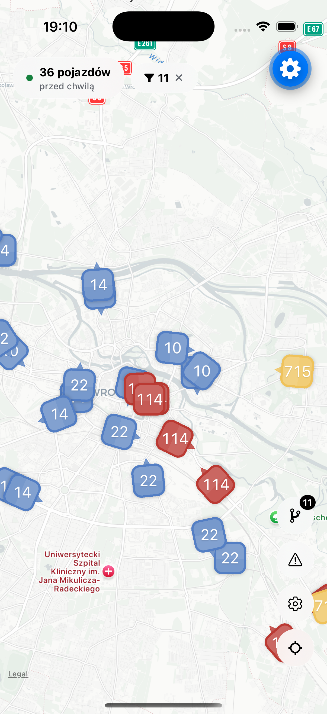
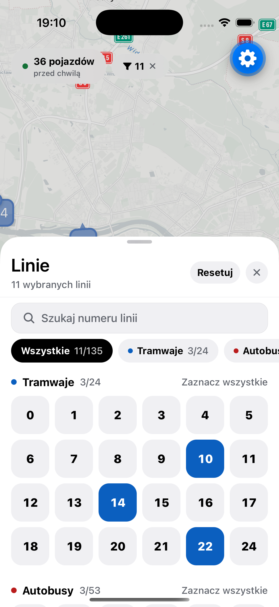
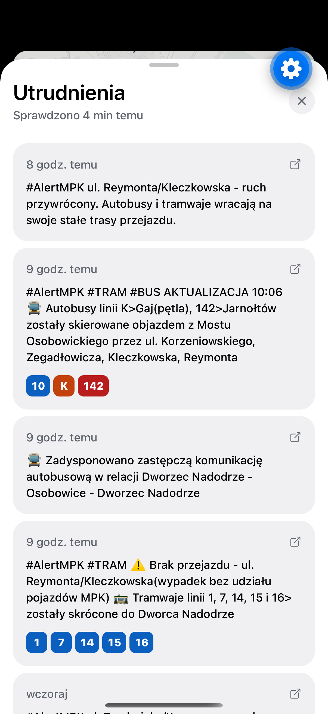

# Wrocław MPK Map

Real-time tracking for Wrocław's trams and buses: an Expo app and the API that feeds it.
Vehicle positions come from MPK Wrocław's public endpoint, supplemented by the city's own
open-data vehicle table (so a bus keeps its number and brigade, and stays on the map when one
feed stumbles), timetables and route shapes from the city's GTFS feed, and disruption notices
scraped from public city and MPK pages.

<div style="display: flex; gap: 10px;">
    
    
    
</div>

> Not affiliated with MPK Wrocław. It reads public data the city publishes as open data.

## Quick start

```bash
# API
cd server
npm ci
npm run doctor   # confirms MPK and the city portal are answering right now
npm start        # http://localhost:3000

# App (in another terminal)
cd wroclive
npm ci
npx expo start
```

The app finds the API by itself: in development it uses the machine that served
the bundle, on port 3000, so a phone on the same Wi-Fi works with no edits.
Point it somewhere else with `EXPO_PUBLIC_API_URL` (see `wroclive/README.md`).

Open <http://localhost:3000/map> for a browser map and <http://localhost:3000/status> for a
dashboard showing which upstream sources are live.

`/map` is built for a phone: the map is the whole screen and a draggable sheet holds the
line picker, the alerts and — when you tap a stop on a drawn route — the next departures.
On a wide window the same sheet becomes a side panel. It needs no build step and no
framework; it is one file, `server/views/map.html`.

## Why things break, and how this handles it

Both upstream sources have moved before — the city migrated its open-data portal, and the
`bus_position` endpoint has changed shape more than once. So no URL is hardcoded in one
place:

- **The GTFS archive is discovered at runtime, never hardcoded.** The server asks the
  city's data API (`api.open-data.cui.wroclaw.pl/od2/6/`), falls back to the legacy CKAN
  instance and then a national mirror. A hardcoded resource UUID on the portal the city
  retired in April 2026 is exactly what broke this project.
- **It picks the timetable actually in force.** That archive contains future-dated
  snapshots — on 2026-07-30 it already listed one effective 1 August. Taking the newest
  would show wrong departure times with no error, so selection is *latest effective date
  ≤ today*.
- **Incomplete snapshots are rejected.** Some are missing `shapes.txt`, which would leave
  the map with no routes; each candidate is validated and the next one tried.
- **`npm run doctor`** checks all of them from your machine and prints exactly what failed.
- **The GTFS archive is cached on disk.** If the portal is down at boot, the server starts
  with the last good timetable rather than serving nothing.
- **Both documented request formats are tried.** `bus_position` is described in the wild
  with two different bodies — `busList[bus][]`/`busList[tram][]` and `busList[][]` — and it
  answers `200 []` rather than an error when it does not like the one you sent. The tracker
  tries each, sticks to whichever works, and shows it on `/health` as `vehicles.encoding`.
- **A second, independent vehicle source is merged in.** The city's Open Data table
  (`open-data.cui.wroclaw.pl/hdb/db/14`) is polled on its own timer and matched to the MPK
  fleet by line, type and proximity (250 m), so each matched vehicle gains its number,
  brigade and position time without guessing when two are equally plausible, and a record
  within 350 m of an MPK vehicle of the same line is treated as the same vehicle rather
  than a duplicate. Fresh records with no match are served under their own `open-data:`
  id. One source going down never stops the other, and `/health` reports each separately.
- **Vehicle records are matched by field aliases,** so a renamed `x`/`y` field does not
  silently produce an empty map.
- **A scheduled GitHub Action** runs the doctor daily and opens an issue when a required
  source stops answering.

## API

Base URL: your deployment, or `http://localhost:3000`.

| Endpoint | Description |
| --- | --- |
| `GET /lines` | All lines grouped by category (`tram`, `busNight`, `busExpress`, …) |
| `GET /lines/:category` | One category |
| `GET /locations` | Live vehicle positions, each with where it is headed, its next stop and how late it is. Vehicles matched to the Open Data source also carry `source` (`"mpk"`, `"merged"` or `"open-data"`), `vehicleNumber`, `brigade` and `positionUpdatedAt`. `?line=4,17` and `?type=tram` filter |
| `GET /vehicle/:id` | One vehicle with the stops still ahead of it, their timetabled times and estimated arrivals. `?limit=` `?history=` |
| `GET /shapes/:line` | Route shape and stops. `?lat=&lon=` picks the variant nearest a vehicle and `?heading=` the direction it is running, `?format=compact` halves the payload |
| `GET /shapes/:line/variants` | Every variant of a route |
| `GET /stops?q=rynek` | Stop search, diacritic-insensitive |
| `GET /stops/near?lat=&lon=` | Stops near a point, nearest first. `?radius=` (m) `?limit=` |
| `GET /stops/:line` | Every stop served by a line |
| `GET /stop/:id` | Stop details |
| `GET /stop/:id/departures` | Next departures, filtered to services running today. `?limit=` `?within=` (minutes) |
| `GET /alerts` | Disruption notices. `?since=` (ms epoch) `?line=` |
| `GET /incidents` | Cached incident timelines grouped from source alerts. `?since=` (ms epoch) `?line=` `?status=` |
| `GET /health` | Status of every upstream source (GTFS, both vehicle sources, alerts) and index |
| `GET /map`, `GET /status` | Mobile-first browser map — lines, alerts, departures, and a tapped vehicle's direction and remaining stops — and the status dashboard |

`/shapes/:line` returns the verbose legacy payload by default so app builds already on
people's phones keep working; `?format=compact` is what the current app requests.

The server's optional admin statistics are identifier-free. They retain aggregate request
counts and estimate active client-hours from the app's ten-second `/locations?format=map`
polls; they never read or store client IPs, cookies, user agents, or device identifiers.
That estimate is usage time, not DAU. Use App Store Connect's opt-in Active Devices metric
when an iOS device count is needed. `STATS_ENABLED=false` disables the aggregate counters.

## AI incident timelines

Source notices are grouped into incident timelines at backend alert-refresh time;
the original source alerts remain available unchanged from `GET /alerts`. `GET /incidents`
serves the cached/generated incident state and never calls a model for an app request.

AI enrichment is optional and disabled by default. Without it, the server uses a
deterministic fallback that still groups notices and builds timelines at no AI cost. A hosted
OpenRouter or Command Code provider, or a local Ollama model, can be selected explicitly by
environment variables documented in [`server/.env.example`](server/.env.example). Provider
keys stay on the server. Models may organize source-backed text and place names, but all
coordinates remain owned by trusted map/GTFS data and are never generated by AI.

## Repository layout

```
server/
  index.js           Entry point: starts HTTP first, loads data in the background
  src/config.js      Every tunable and upstream source
  src/gtfs/          Discover, download, parse, index and query the GTFS feed
  src/gtfs/catalogue.js  Which snapshot to use, and why
  src/vehicles.js    Live position polling and normalisation
  src/open-data.js   The city's Open Data vehicle source: parsing, Warsaw time, merging
  src/progress.js    Positions onto the timetable: direction, next stops, delay
  src/alerts.js      Notice pages: RSS if they offer it, scraped otherwise
  src/routes.js      HTTP endpoints
  scripts/doctor.js  Upstream connectivity check
  test/              Unit and HTTP tests, no network required
wroclive/            Expo app (SDK 57, React Native 0.86, React 19.2) — iOS + Android + web
  src/app/           expo-router screens: the map, plus lines, alerts, settings
  src/lib/api.ts     The only app→server path — retries the 503 cold start, validates payloads
  src/lib/map-html.ts   The Leaflet map page (web build), mirroring server/views/map.html
  src/lib/lines.ts   Line colours (kept in step with the browser map) and category labels
  src/components/    Map surfaces, vehicle and stop sheets, line badge, glass chrome
  README.md          App-specific operating notes
landing/             Static Polish landing page (index.html + screenshots)
  map.html           The same browser map as /map, statically served; the API
                     defaults to api.wroclive.kijmoshi.xyz (localhost:3000 on
                     localhost) and can be set with ?api=
```

## Development

```bash
cd server
npm test       # unit + HTTP integration tests against an in-memory GTFS fixture
npm run lint
npm run dev    # restarts on change

cd wroclive
npm run lint
npm run typecheck
npx expo export --platform web --output-dir dist   # compile check + browser preview
```

Tests build a small GTFS archive in memory, so they run offline and in CI.

`AGENTS.md` at the repo root documents the invariants — each one is written as a rule
because it is a bug that already happened. Read it (and `wroclive/AGENTS.md` before
touching the app) before changing the feed, the wire format or the app's data flow.

## Deploying

The server holds the whole timetable in memory. Budget roughly 400 MB with the departure
index enabled, about half that with `GTFS_BUILD_STOP_INDEX=false`.

```bash
docker build -t wroclaw-mpk-api ./server
docker run -p 3000:3000 -v gtfs-cache:/app/data wroclaw-mpk-api
```

`server/render.yaml` deploys it to Render as-is. Any host works — it is a plain Node
process with no database. Mount a volume at `/app/data` so the cached GTFS archive
survives restarts.

See [`server/.env.example`](server/.env.example) for every setting.

## Publishing the app

`wroclive/app.json` holds the store metadata; the API URL comes from
`EXPO_PUBLIC_API_URL` at build time (set per profile in `wroclive/eas.json`), so no
plain-HTTP address ships in the bundle.

```bash
cd wroclive
npx expo-doctor                                    # config and dependency check
eas build --platform android --profile production
eas submit --platform android
```

The Android build runs unattended. The **first** iOS build must be run from a real
terminal — EAS creates the distribution certificate by signing in to Apple and cannot
prompt for that in CI, which surfaces as `Credentials are not set up. Run this command
again in interactive mode.` See
[`wroclive/README.md`](wroclive/README.md) for app-specific notes.

Before the first submission you still need to, outside this repo:

- create the Play Console and App Store Connect listings,
- provide a privacy policy URL (the app retains no personal data; location stays on the device),
- upload screenshots and a feature graphic,
- point `EXPO_PUBLIC_API_URL` in `eas.json` at your deployed API.
- on Android, register a Google Maps SDK key and wire the `react-native-maps` config
  plugin (`wroclive/app.json`), since a store build cannot use the API key Expo Go
  carries.

## Data sources

- Timetables: [Otwarte Dane Wrocław](https://opendata.cui.wroclaw.pl/), resolved through
  the CUI data API at runtime
- Vehicle positions: `POST https://mpk.wroc.pl/bus_position`, supplemented by
  `GET https://open-data.cui.wroclaw.pl/hdb/db/14?download=json` (the city's own live
  vehicle table — merged onto the MPK fleet, see `.env.example` for the matching rules)
- Disruptions: `@AlertMPK` on X, the only account publishing live incidents. The
  timeline API needs a paid tier and Nitter is gone, so it is read through an RSS
  bridge you run (`ALERT_X_BRIDGE_URLS`). **Nothing is configured by default** — a
  stock deploy serves no alerts until you set a source up
- Disruptions (optional, extra source): the city's notice pages, e.g.
  `wroclaw.pl/komunikacja/zmiany-w-komunikacji` (`ALERT_PAGE_URLS`). These carry
  *planned* changes — stop relocations, roadworks, event closures — not incidents,
  so they supplement `@AlertMPK` rather than replacing it. `npm run scrape:alerts`
  prints what each configured source actually yields

Check the terms of use of each source before deploying publicly.

## License

MIT — see [LICENSE](LICENSE).
